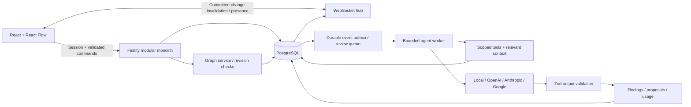

# AgentSpace architecture

## Domain and user flows

The canonical object is a project system graph. A workspace owns projects, reusable skills, and agents. Project membership is explicit and separate from workspace administration. Components own typed configuration; directed edges describe contracts. Views select categories from these same entities. Versions are immutable graph snapshots identified by a monotonically increasing project revision.

A human creates a workspace/project, adds or imports components, connects dependencies, and invites colleagues. A review gathers context, lets specialists collaborate, produces findings and proposed patches, and stops. An owner/admin examines a proposal's exact change and tradeoffs. Approval commits the graph and audit record atomically; rejection does not change architecture.

## Technology decisions

React + Vite is a fit for a dense authenticated editor; this product does not require SEO or server-side rendering. A persistent Fastify backend cleanly owns sockets, transactions, and the agent worker. TypeScript and Zod share API contracts across the boundary. Hand-authored parameterized SQL makes locking and referential integrity explicit instead of hiding approval semantics in an ORM abstraction. SQL migrations are ordered and recorded in `schema_migrations`.

PostgreSQL is the source of truth. PGlite executes the same schema for an installation-free local workflow and integration tests. No Redis is required for a one-instance MVP: ephemeral presence belongs in memory, while review jobs and events must survive process restarts and therefore belong in PostgreSQL. Add Redis or PostgreSQL pub/sub for multiple instances only after implementing distributed leases and fan-out.

## Relational model

Identity: `users`, `sessions`, `workspaces`, `workspace_members`, `project_members`, `invitations`.

Architecture: `projects`, `components`, `edges`, `architecture_views`, `architecture_versions`, `component_repository_mappings`, `repository_connections`.

Agents: `agents`, `skills`, `agent_skills`, `agent_tool_grants`, `agent_runs`, `tool_executions`, `usage_events`.

Collaboration and governance: `messages`, `comments`, `findings`, `proposals`, `events`, `audit_logs`, `knowledge_sources`.

Composite project/component foreign keys prevent edges and mappings from referring to components in another project. Composite project/agent constraints do the same for agent findings/messages/proposals. Deleting a graph component cascades its edges, comments, and mappings; historical versions and evidence remain. Proposal before/after snapshots preserve the decision record. The project revision is unique in architecture versions. Invitations and sessions store SHA-256 hashes of high-entropy tokens, not bearer secrets.

## Real-time consistency

1. A client submits a bounded list of typed mutations and the revision it read.
2. The graph service locks the project row `FOR UPDATE` and compares revisions.
3. It applies the patch, validates graph invariants, writes canonical rows, increments the revision, appends the snapshot, audit entry, and outbox event in one transaction.
4. A post-commit invalidation causes clients to refetch an authorized snapshot. Reconnection also refetches; periodic polling repairs missed notifications.
5. Conflicting writes return `409`. The UI reports the conflict and fetches current data; it does not silently retry a stale configuration.

An entire-project revision favors correctness over throughput for the MVP. Independent node edits may conflict, but they cannot silently overwrite each other. A later per-entity revision scheme can reduce conflicts while retaining cross-entity transactional validation.

Yjs/CRDTs are valuable for shared text, transient drag positions, or offline collaboration. Applying arbitrary concurrent CRDT operations directly to an authorization-sensitive relational graph would still require validation of deleted endpoints, proposal preconditions, and role changes. The MVP therefore uses authoritative commits and treats presence/selection/cursors as transient non-authoritative state. Offline writes are not supported.

Snapshot reads hold a share lock on the project while reading graph rows and revision, avoiding mixed graph versions. A crash after commit cannot lose the audit/version. The outbox broadcasts at least once; client invalidation is idempotent. A server restart explicitly fails interrupted runs instead of silently repeating potentially billable calls.

## Agent orchestration

Agents are persisted configurations, not frontend chatbot components. The runtime retrieves their enabled status, current instructions, attached skill revisions, and tool grants. Provider adapters implement `LLMProvider.generate` and return the common `AgentOutput` contract. Each response can contribute an engineering message, structured findings, safe configuration proposals, and up to two delegated questions.

Only authorized graph reads are currently executable. All proposed mutations pass through graph schemas and human approval. The runtime cannot deploy, execute shell commands, write a repository, or reach arbitrary URLs. External adapters must implement these boundaries explicitly rather than sharing a privileged generic credential.

Run controls:

- one active run per project, enforced by a partial unique index;
- ten-second project cooldown;
- five distinct participating agents; each executes once per run;
- delegation depth at most two and at most two requests per response;
- input/output reservation budget and 3,000 output tokens per call;
- 60-second provider timeout;
- findings require evidence and confidence at least 0.65;
- project-scoped finding fingerprints suppress duplicates;
- pending proposals with the same title are suppressed;
- agent responses do not produce recursively triggering review events;
- persisted failed/completed statuses and operational logs, with no chain-of-thought storage.

The system architect requests peer reviews; peers receive recent project discussion including previous agent output. Responses can agree, challenge, or request more evidence in their messages. Local agents implement deterministic configuration checks as an executable offline reference, not simulated LLM responses.

## Context and permissions

Each call revalidates the requesting human's project membership. Each agent must be enabled and have an exact `project.graph.read` grant against the current project. Context consists of a selected component and its one-hop neighbors, or a bounded graph, at most four recent relevant knowledge documents, eight recent discussion excerpts, and current shared skill instructions. Graph context caps at 60 components/100 edges; prompts exceeding the budget fail rather than silently expanding spend. All project content is treated as untrusted data in provider instructions.

For future semantic retrieval, first apply tenant/resource permission filters, then combine graph proximity, metadata, recency, and embedding similarity. Embedding stores are retrieval indexes rather than authorities; every result must be rechecked against relational permissions. Sensitive documents will need their own visibility scope before supporting restrictions finer than project membership.

## Mentions, inbox, and observe mode

Mentions are resolved server-side against enabled project agents and current members; the client never decides who is addressed. Agent handles accept the compact name (`@SecurityEngineer`), the role (`@security`), and `@<role>Agent`. Agents take precedence over humans for the same handle. A message with mentions creates one run whose `participant_ids` all start at depth zero, so the per-run limits (five agents, depth two, token budget, one active run) still apply. A run started from a component comment posts each agent's message back into that thread (`comments.agent_id`; a check constraint enforces exactly one author kind). If the project is busy, the comment is still saved and the author is told.

Notifications are rows per recipient, written in the same transaction as the event that causes them: approval requests only for owners/admins, high-severity findings for non-viewers, review completion only for the requester (automatic post-edit reviews stay silent). Inbox reads re-check project membership.

Observe mode treats a deployment manifest as the observed system. `server/discovery.ts` is pure: it parses Compose (alias expansion capped), `package.json`, or `requirements.txt` into components and edges with confidence and evidence. Environment variable values are scanned for service host names and literal secrets, then discarded; only derived structure is stored. Drift compares the observed graph with the canonical graph: explicit mapping, then normalized names, then technology (infrastructure only, and only when unique on both sides). A Compose file scopes the comparison to the deployable system (external services and CDNs excluded); a single-application manifest scopes it to that application and its direct data dependencies. Each observation is also written as a knowledge document so agents retrieve it through the normal bounded context path.

## Proposal preconditions

Approval checks the human role, locks the project then proposal in a consistent order, verifies `PENDING` and the exact base revision, applies changes, persists before/after snapshots, and records the approving human in the same transaction. Duplicate approvals and stale proposals return `409`. A stale proposal can be rejected and regenerated against current context. Automatic rebasing is deliberately deferred because it can change the meaning of a reviewed decision.

## Extension sequence

Next useful slices: GitHub App read-only repository ingestion with provenance; import discovery requiring human review; repository/component drift; durable MCP transport adapters with egress/resource restrictions; actual tool approval records; metrics and deployment observations; per-document authorization; object storage and upload scanning; then multi-instance presence/worker leases and CRDT documents. Add these as modules before considering additional services.
